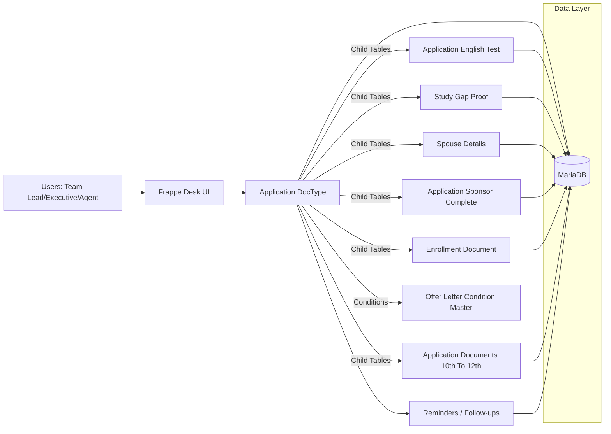

# Unideft — AI‑Driven Visa Management CRM 

Unideft is an **AI‑driven visa management CRM** built on the **Frappe/ERPNext** framework for overseas education and migration consultancies. It models each client matter as a single **Application** record with a stage‑based workflow (Processing → Financials → GS Processing → Acceptance → COE → File Lodged → Visa → Enrolled), combining **forensic‑grade traceability**, structured evidence capture, and **analytics‑ready data**.

This repository is published as a **sanitized showcase**: it highlights architecture and implementation patterns while intentionally excluding sensitive configurations and any real client data.

---

## Screenshots


---


## 🔑 Key Highlights

- **End‑to‑end case lifecycle modeling**: The visa journey is structured into a single auditable **Application** entity with defined stages and conditional transitions.
- **Forensic‑grade traceability**: Linked, normalized data (student, sponsor, conditions, refusals, gap proofs, documents) enables fast reconstruction of “what happened and why.”
- **Rule‑based logic & risk flags**: Business rules for offer‑letter conditions, English requirements, gap justification, and interview scheduling are enforced via conditional logic.
- **Evidence workflows**: Document schemas and verification flags support systematic review (ITR, salary slips, SOPs, offer letters, sponsor proofs).
- **Analytics‑ready foundation**: Strongly structured child tables + categorical statuses are suitable for downstream scoring/anomaly detection/cohort analysis.

---

## 🧩 Core Features

Unideft models visa operations as a **stage‑based workflow** centered on the `Application` doctype, with separate tabs for Processing, Financials, GS Processing, Acceptance, COE, File Lodged, Visa, and Enrolled. The form is heavily **context‑aware**: sections render only when relevant (e.g., spouse pathways, refusal handling, interview requirements, study gap proof types), guiding users through a consistent process and reducing operational variance across teams.

The system is designed for **evidence‑driven decisioning**. Documents are captured in structured tables (not generic attachments), and paired with verification flags/status fields (e.g., sponsor proofs, financial artifacts, English test formats, gap proofs). This supports auditability and rapid matter reconstruction—key when cases require formal review, escalation, or defensible documentation.

Finally, the data model is intentionally **analytics‑first**. Normalized child doctypes and categorical statuses create a clean foundation for advanced analytics and AI: risk scoring (e.g., gap/refusal patterns), anomaly detection, SLA bottlenecks by stage, and cohort analysis across destinations, sponsors, and outcomes.

---

## 🏗️ Architecture Overview



---

## ✨ Implementation Snippets

These snippets are included to show **how** the system enforces workflows and remains analytics‑ready.

### 1) Forcing complex child tables to open in a full modal form

Some child tables are intentionally edited via a modal (form view) for usability and data quality.

Source: `erpnext/crm/doctype/application/application.js`

```js
onload(frm) {
  // Force form view (modal) for child tables that should open in dialog on Add Row
  const form_view_tables = ["spouse_details_list", "table_ihmq"];
  form_view_tables.forEach((fieldname) => {
    const doctype = frm.meta.fields.find((df) => df.fieldname === fieldname && df.fieldtype === "Table")?.options;
    if (doctype) {
      frappe.model.with_doctype(doctype, () => {
        const meta = frappe.get_meta(doctype);
        if (meta) meta.editable_grid = 0;
      });
    }
  });
},

refresh(frm) {
  // Force Spouse Details and C. Sponsors tables to open in form/modal on Add Row
  ["spouse_details_list", "table_ihmq"].forEach((fieldname) => {
    const control = frm.fields_dict[fieldname];
    if (control && control.grid && !control.grid._form_view_patched) {
      control.grid.allow_on_grid_editing = function () {
        return false;
      };
      control.grid._form_view_patched = true;
    }
  });
}
```

### 2) Table MultiSelect → dynamic “Conditions” sections

Offer‑letter conditions are stored as **Table MultiSelect rows**, and Financials sections appear based on selected `condition` values.

Source: `erpnext/crm/doctype/application/application.json`

```js
// depends_on pattern used for conditional section rendering
eval:
doc.conditions_on_offer_letter
&& Array.isArray(doc.conditions_on_offer_letter)
&& doc.conditions_on_offer_letter.some(function(r){
  return (r.condition || '').indexOf('Interview') !== -1;
})
```

### 3) Structured evidence tables (purpose‑built child doctype)

Instead of a generic “documents” table, certain stages use tailored doctypes to maintain clean semantics.

Source: `erpnext/crm/doctype/application_documents_10th_to_12th/application_documents_10th_to_12th.json`

```json
{
  "istable": 1,
  "fields": [
    {
      "fieldname": "document_type",
      "fieldtype": "Select",
      "label": "Document Type",
      "options": "\n12th Admit card\nschool domain email id\ndigilocker id/password"
    },
    {
      "depends_on": "eval:doc.document_type == 'school domain email id' || doc.document_type == 'digilocker id/password'",
      "fieldname": "write_details",
      "fieldtype": "Small Text",
      "label": "Write Details"
    },
    {
      "fieldname": "upload_document",
      "fieldtype": "Attach",
      "label": "Upload Document"
    }
  ]
}
```

---

## 🧱 Tech Stack

- **Framework**: Frappe / ERPNext
- **Backend**: Python
- **Client**: JavaScript (form scripts)
- **Database**: MariaDB (via Frappe)
- **UI**: Frappe Desk (DocTypes, Tabs, Child Tables, conditional sections)

---

## 🛠 Setup (High‑Level)

> Keep setup simple for reviewers; production deployments may differ.

```bash
cd /path/to/frappe-bench/apps
git clone https://github.com/<your-username>/unidef-erp.git

cd /path/to/frappe-bench
bench --site <site-name> install-app erpnext
bench migrate
bench clear-cache
bench restart
```

---

## Notes / Sanitization

- No secrets, tokens, or real client data are included.
- If you want access to a full private demo environment, contact the author.
